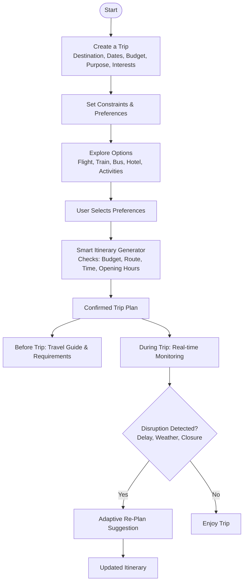

# TripMate Assistant by Code-Catalyst

**Team:** Nurul Shafiyah binti Zulkarnain, Raja Adam Haziq bin Raja Muhd Zulkhairi, Danish Shazwan bin Muhammad Khusyairi  
**Problem Statement:** Travel Planner  
**Video Presentation:** [Unlisted YouTube Link]  
**Presentation Slides:** [Public Link]

---

# 1. Project Overview

## The Problem

Planning a trip can be complicated because travellers need to manage different aspects of their journey, such as creating an itinerary, checking transportation, managing their budget and coordinating with travel companions.

This becomes more challenging for group travellers because members may have different **preferences, schedules and budgets**. Travellers may also need to switch between multiple applications to plan their trip, communicate with their group and access travel-related information.

The main stakeholders are **travellers, particularly those travelling in groups**, who need a simpler way to organise and coordinate their trips.

Existing applications such as Google Maps provide useful location, navigation and transportation information. However, they are primarily focused on navigation and do not provide an integrated experience for **group itinerary planning, AI travel assistance, group communication and currency-related travel utilities**. As a result, travellers may still need to switch between multiple applications when organising and managing a group trip.

## Our Solution

**TripMate** is a travel companion designed to simplify group travel by bringing **trip planning, itinerary management and supporting travel utilities** into one platform.

The application helps users organise their trip based on their **schedule, budget and preferences**, while also providing supporting features for group travel, such as **AI assistance, walkie-talkie communication and currency exchange information**.

Instead of switching between multiple applications, travellers can access these functions within a single travel experience.

### Feature Set

* Travel Planning
* Itinerary Management
* Transport Information
* AI Travel Assistance
* AI Expense Management
* Group Communication through Walkie-Talkie
* Currency Exchange
* Exchange Location Recommendations

---

# 2. Ideation & Process

## 2.1 Ideas We Considered

| Idea                             | Why it was dropped / kept                                                                                                              |
| -------------------------------- | -------------------------------------------------------------------------------------------------------------------------------------- |
| Travel Planner                   | **Chosen** — Provides a central platform for managing different aspects of a trip.                                                     |
| Travel Itinerary                 | **Chosen** — Helps users organise destinations and activities based on their trip.                                                     |
| Transport Planning               | **Chosen** — Helps travellers plan how to move between destinations.                                                                   |
| Group Communication              | **Chosen** — Supports communication between members during a group trip.                                                               |
| Walkie-Talkie                    | **Chosen** — Provides a quick push-to-talk communication method for travelling groups.                                                 |
| Currency Exchange                | **Chosen** — Allows travellers to check currency rates and manage currency conversion.                                                 |
| Exchange Location Recommendation | **Chosen** — Helps users identify nearby places where they can exchange currency.                                                      |
| Shared Gallery                   | **Dropped** — Not prioritised due to implementation complexity and the limited hackathon timeframe.                                    |
| Community Group                  | **Dropped** — Not prioritised due to implementation complexity, particularly the backend requirements for managing group interactions. |

---

## 2.2 Ideation Boards

*Figure 1: Initial Brainstorming Session*

This ideation board shows the team's brainstorming process and the different challenges and ideas considered for improving the travel experience.

The team explored areas such as trip planning, group communication, transportation and currency exchange before refining the ideas into the selected Travel Planner features.

---

## 2.3 Mentor Consultation

| Date         | Mentor      | Feedback Received                                                                                                                                                                                                                                                                                                                                                                                                                                                                                                                                    | What Was Changed                                                                                                                                                                                                                                                                                                                                                                                                                                                                                                                                                               |
| ------------ | ----------- | ---------------------------------------------------------------------------------------------------------------------------------------------------------------------------------------------------------------------------------------------------------------------------------------------------------------------------------------------------------------------------------------------------------------------------------------------------------------------------------------------------------------------------------------------------- | ------------------------------------------------------------------------------------------------------------------------------------------------------------------------------------------------------------------------------------------------------------------------------------------------------------------------------------------------------------------------------------------------------------------------------------------------------------------------------------------------------------------------------------------------------------------------------ |
| 10 Sept 2026 | Faris Imran | • Reduce the number of features and screens to keep the prototype focused and ensure all key features can be demonstrated within the presentation time. • Use AI as a travel guide to assist users with travel preparation and related questions. • Focus on solving the main problems identified, such as adjusting travel plans and handling different user preferences. • Include a user flow diagram to clearly show how users interact with the system. | • **AI Travel Guide:** The Travel Guide page was integrated into the **Group Chat**, allowing users to interact with the built-in AI for travel preparation, recommendations and other travel-related questions. • **Manual Itinerary Planning:** An **“Add Itinerary”** button was added to the **Plan** page, allowing users to manually set the date, time and activity for their itinerary. • **Simplified Interface:** Related functions were consolidated into fewer screens to reduce unnecessary navigation while keeping the main purpose of the application. |

---

# 3. Design & Prototype

**UI Prototype:** https://www.figma.com/make/BW6GEJv6Iljx8Ylykz6AnH/Travel-Planner?t=Iwu3L3pwSdeyaUaq-1

The prototype focuses on the user interface and interaction flow of **TripMate**. The key screens demonstrate how users can plan their trip, manage their itinerary, access travel-related information and interact with their group during a trip.

## Key Screens

### 1. Travel Planning

Users can enter their travel information and begin organising their trip with TripMate.

The planning experience helps users organise their activities and travel plans based on their trip requirements.

### 2. Itinerary

Users can view their planned activities and destinations in an organised itinerary.

The itinerary provides a clear overview of the user's travel plans and allows users to manage their scheduled activities.

### 3. Group Communication — Walkie-Talkie

The Walkie-Talkie feature allows members of a travel group to communicate using push-to-talk voice communication.

Users can hold the microphone button to quickly send a live voice message to their group while travelling through a continuous radio-like communication.

The app then store and shows transcripts of the user's voice for reviewing.

### 4. Currency Exchange

The Currency Exchange feature allows users to check currency conversion and exchange rates while travelling.

Users can enter an amount and view the corresponding value in another currency.

### 5. Exchange Location Recommendations

In addition to checking currency rates, users can discover nearby currency exchange locations.

The prototype provides information such as location, distance, rating and exchange rate information to help users compare available options.

---

# 4. What Makes It Different

TripMate goes beyond basic itinerary planning by using **AI to actively assist group travellers throughout their trip**, rather than only generating an itinerary at the beginning.

## AI-Assisted Adaptive Planning

The AI can detect travel disruptions and understand their impact on the itinerary. For example, if a train is delayed by 45 minutes and a planned destination closes at 5:00 PM, the AI can suggest alternative options in the group chat and update the itinerary once the group agrees on a new plan. 

## AI-Assisted Expense Management

The AI also works within the group chat to recognise travel-related expenses. For example, when a member mentions paying ¥8,000 for a taxi, the AI can identify the expense and suggest splitting the cost equally among group members, helping the group keep track of their shared budget. 
## AI Travel Assistance

Travel-related questions and preparation assistance are available directly inside the group's conversation instead of requiring users to switch to another AI or travel application.

## Group Travel Features

TripMate also provides supporting features designed for group travel, including **Walkie-Talkie communication, currency exchange information and exchange location recommendations**.

## Integrated Travel Experience

The key difference is that TripMate combines **adaptive AI assistance, itinerary management, group communication, expense support and travel utilities** within a single group travel experience.

---

# 5. Technical Architecture & Feasibility

## Tech Stack

| Component           | Technology           | Why We Chose It                                                                                     | Expected Constraints                                                                                  |
| ------------------- | -------------------- | --------------------------------------------------------------------------------------------------- | ----------------------------------------------------------------------------------------------------- |
| Frontend            | Flutter              | Allows us to build a cross-platform mobile application with a single codebase.                      | The team may need to manage responsive layouts and different device screen sizes.                     |
| Backend             | Firebase             | Provides backend services that can be integrated quickly during the hackathon development period.   | Reliance on Firebase services may introduce limitations based on available features and usage limits. |
| Database            | Cloud Firestore      | Provides a cloud-based database suitable for storing user and trip information.                     | Requires proper database structure and security rules as the application grows.                       |
| AI Service          | Google Gemini API    | Provides AI capabilities for travel assistance, itinerary planning and responding to user queries. | API usage limits, response reliability and internet connectivity may affect the AI features.         |
| Maps / Location API | Google Maps Platform | Provides location and transportation-related information that supports travel planning.             | API usage may be subject to quotas, availability and configuration requirements.                     |
| Currency API        | ExchangeRate-API     | Provides exchange rate information for the currency exchange feature.                               | Exchange rate data depends on the availability and limitations of the external API.                   |
| Hosting             | Firebase Hosting     | Provides a convenient platform for deploying the application and related web services.              | Deployment depends on Firebase configuration and service availability.                                |

## Technical Considerations

The project relies on several external APIs and services, particularly for **AI, maps/location information and currency exchange**. These services may have API limits, require internet connectivity or depend on third-party availability.

The **Walkie-Talkie** feature may require real-time communication capabilities, which could introduce additional implementation complexity.

Due to the limited 3-week development period, the team will prioritise the core features and implement more complex features based on their technical feasibility and available development time.

---

## Build Plan & Scope

During the 3-week building phase, the team will focus on implementing the main TripMate experience and its most important supporting features.

### Core Scope

* Travel planning flow
* Itinerary management
* AI-assisted itinerary planning and adjustments
* AI Expense Management
* Transport information
* AI assistance through Group Chat
* Currency exchange
* Exchange location recommendations
* Group communication / Walkie-Talkie

The team will prioritise a focused and feasible implementation rather than attempting to build every possible travel-related function.

Features that require more complex infrastructure, such as real-time voice communication, may be implemented in a simplified version or deprioritised depending on development time and technical constraints.

The prototype demonstrates the intended user experience and interface, while the building phase will focus on turning the selected core features into a functional application.

---

# Conclusion

TripMate aims to make group travel more convenient by combining **smart travel planning with AI-powered assistance** in one platform.

The application helps groups organise their itineraries, respond to changes during their trip and access travel-related information while also providing supporting features such as group communication and currency exchange.

By bringing these functions together, TripMate provides travellers with a more connected, flexible and organised travel experience.

**We don't just plan your trip, we make travelling together easier.**
